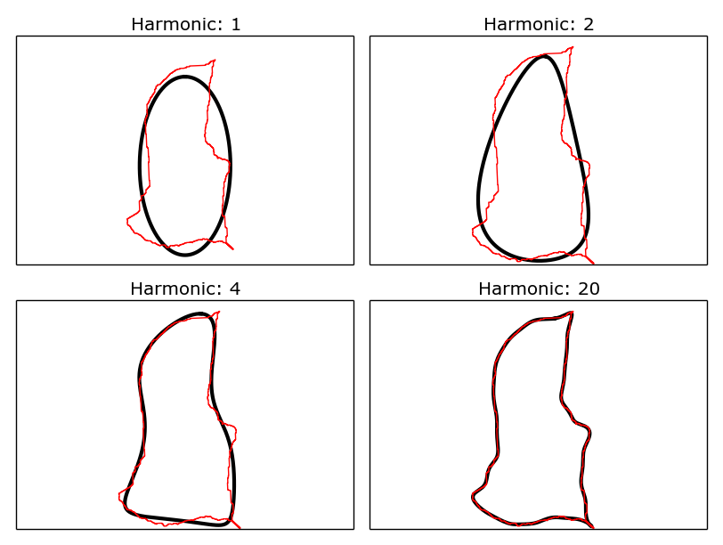

# Summary

A Python implementation of the calculation of elliptical Fourier descriptors as described by @kuhl1982elliptic. This package is designed to allow the rapid analysis of spatial data stored as ESRI shapefiles, handling all of the geometric conversions. The computed Fourier ellipses can then be written back to shapefiles to allow analysis with other spatial data, or can be plotted using matplotlib [@Hunter2007]. The code is built upon the @pyefd module and it is hoped that this package will make analyzing spatial data using Fourier ellipses more straightforward.

This package implements the original methodology of @kuhl1982elliptic to compute Fourier coefficients from polygon data loaded from shapefiles, and to transform these coefficients back into spatial coordinates with a range of different coordinate normalization schemes. The number of harmonics required to describe a polygon to a user defined threshold Fourier power can be computed, following @costa2009quantitative. The averaging of Fourier coefficients is also implemented, as described by @raj1992, which can be used to provide averaged shapes to machine learning algorithms. Functions are available to handle the challenges of relating spatial coordinates to the normalized Fourier ellipse coordinates, to allow the calculated Fourier ellipses to be output as shapefiles for further analysis in GIS packages.

The latest stable release of the software can be downloaded from [pypi](https://pypi.python.org/pypi/spatial_efd), the development version is available on [github](https://github.com/sgrieve/spatial-efd/) and the full documentation and API can be found [here](https://spatial-efd.readthedocs.io).

Figure 1: Examples of Fourier ellipses (black) being fitted to a shapefile outline (red), for increasing numbers of harmonics.

# Acknowledgements

The development of this software has been supported by Natural Environment Research Council grants NE/J009970/1 and NE/N01300X/1.

# References
